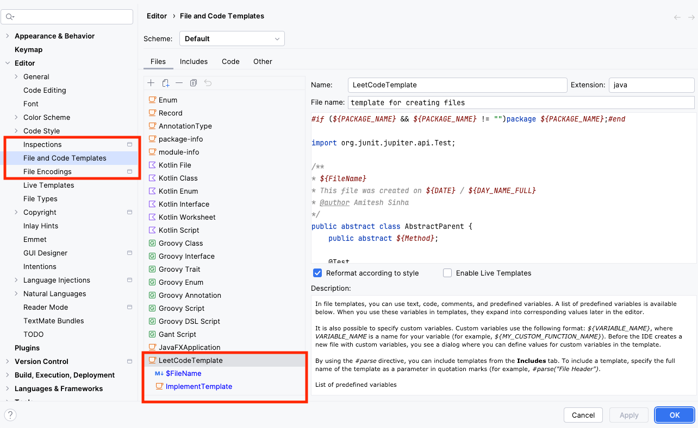
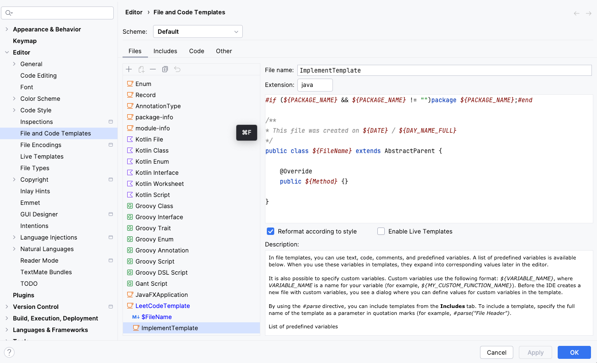
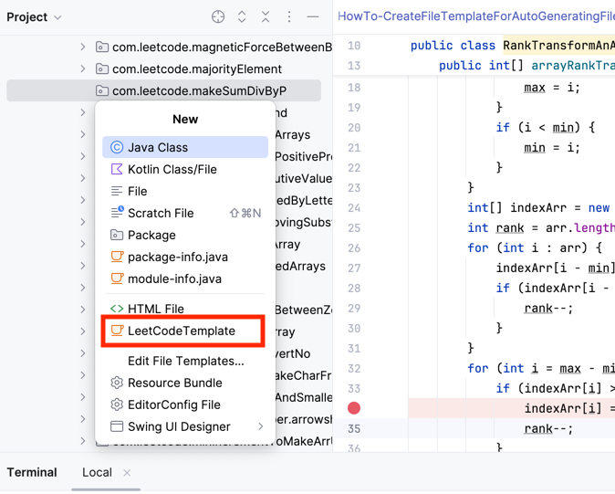
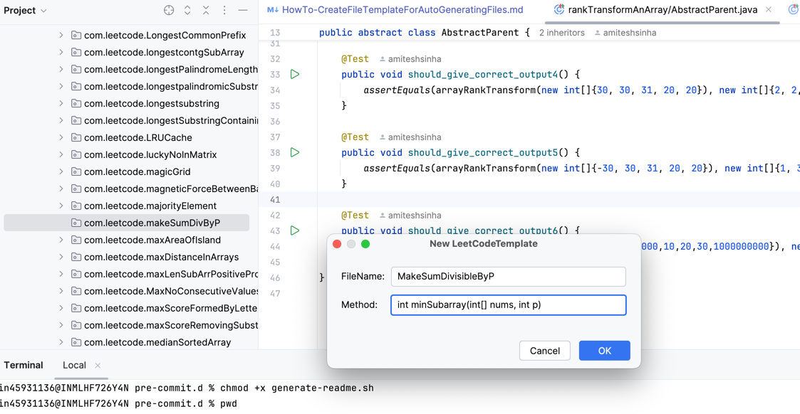
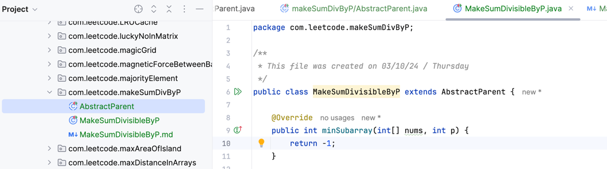

## Problem Statement - 

For any leetcode problem I attempted I wanted to follow a structured route to solving it. 
I realised that for solving any problem - i wanted to have the following approach
1. An Abstract Parent class - that will encapsulate the test cases and abstract away the function to be implemented
2. The main code class - that would inherit the abstract parent and implement the function. If I have multiple approaches - I can create as many classes as required without requiring any change to the test cases
3. The readme file - which would link up with the leetcode problem.

## Solution - 

I created the following File Template in Intellij to generate the files automatically -
The templates are created in Intellij under Settings > Editor > File and Code Templates

### For Abstract Parent -

### For Main Method Class - 

### For the readme with the same file name 
 
 - you can simply set that as a child template with $FileName as your identifier

Now when you try to solve a new leetcode problem 

- create a package 
- the option for the template should come up in the menu

- This will give you the following popup

- The files are then auto-generated in the package

